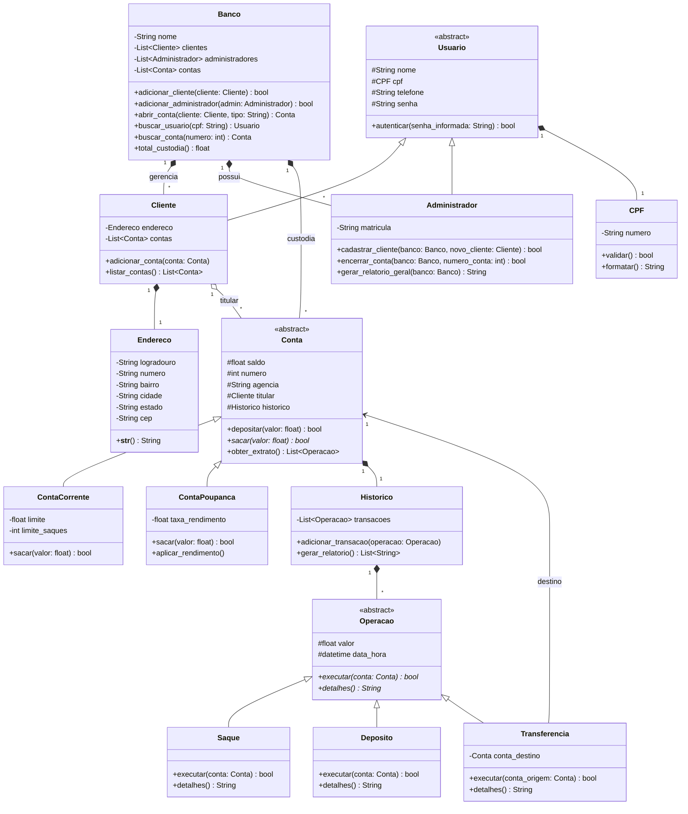

```mermaid
    classDiagram
        class Banco {
            -String nome
            -List~Cliente~ clientes
            -List~Administrador~ administradores
            -List~Conta~ contas
            +adicionar_cliente(cliente: Cliente) bool
            +adicionar_administrador(admin: Administrador) bool
            +abrir_conta(cliente: Cliente, tipo: String) Conta
            +buscar_usuario(cpf: String) Usuario
            +buscar_conta(numero: int) Conta
            +total_custodia() float
        }

        class Usuario {
            <<abstract>>
            #String nome
            #CPF cpf
            #String telefone
            #String senha
            +autenticar(senha_informada: String) bool
        }

        class Cliente {
            -Endereco endereco
            -List~Conta~ contas
            +adicionar_conta(conta: Conta)
            +listar_contas() List~Conta~
        }

        class Administrador {
            -String matricula
            +cadastrar_cliente(banco: Banco, novo_cliente: Cliente) bool
            +encerrar_conta(banco: Banco, numero_conta: int) bool
            +gerar_relatorio_geral(banco: Banco) String
        }

        class CPF {
            -String numero
            +validar() bool
            +formatar() String
        }

        class Endereco {
            -String logradouro
            -String numero
            -String bairro
            -String cidade
            -String estado
            -String cep
            +__str__() String
        }

        class Conta {
            <<abstract>>
            #float saldo
            #int numero
            #String agencia
            #Cliente titular
            #Historico historico
            +depositar(valor: float) bool
            +sacar(valor: float)* bool
            +obter_extrato() List~Operacao~
        }

        class ContaCorrente {
            -float limite
            -int limite_saques
            +sacar(valor: float) bool
        }

        class ContaPoupanca {
            -float taxa_rendimento
            +sacar(valor: float) bool
            +aplicar_rendimento()
        }

        class Historico {
            -List~Operacao~ transacoes
            +adicionar_transacao(operacao: Operacao)
            +gerar_relatorio() List~String~
        }

        class Operacao {
            <<abstract>>
            #float valor
            #datetime data_hora
            +executar(conta: Conta)* bool
            +detalhes()* String
        }

        class Saque {
            +executar(conta: Conta) bool
            +detalhes() String
        }

        class Deposito {
            +executar(conta: Conta) bool
            +detalhes() String
        }

        class Transferencia {
            -Conta conta_destino
            +executar(conta_origem: Conta) bool
            +detalhes() String
        }

        %% Relações do Banco
        Banco "1" *-- "*" Cliente : gerencia
        Banco "1" *-- "*" Administrador : possui
        Banco "1" *-- "*" Conta : custodia

        %% Hierarquia de Usuários
        Usuario <|-- Cliente
        Usuario <|-- Administrador
        Usuario "1" *-- "1" CPF

        %% Relações do Cliente
        Cliente "1" *-- "1" Endereco
        Cliente "1" o-- "*" Conta : titular

        %% Hierarquia de Contas
        Conta <|-- ContaCorrente
        Conta <|-- ContaPoupanca
        Conta "1" *-- "1" Historico

        %% Hierarquia de Operações
        Historico "1" *-- "*" Operacao
        Operacao <|-- Saque
        Operacao <|-- Deposito
        Operacao <|-- Transferencia
        Transferencia --> "1" Conta : destino
```